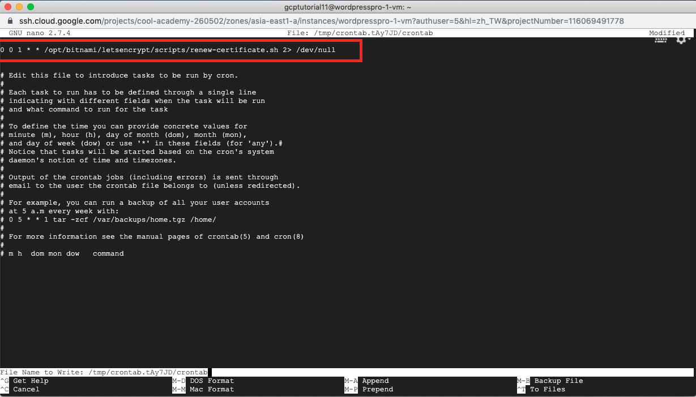

# 19.WordPress + GCP + SSL

## **網站架設流程**

```text
一、申請 Google 帳號並啟用 GCP 雲端主機
二、開一台專門給 WordPress 用的機器並啟用 WordPress
三、將網域名稱 (Domain Name) 對應到 GCP 雲端主機
四、申請 SSL 憑證並設定自動更新
```

準備好了嗎? 最完整的免費網站架設教學要開始囉!

### 一、申請 Google 帳號並啟用 GCP 雲端主機

STEP1:


STEP2:  
填入各種資訊，這邊就不另多做說明了  


### 二、啟用 GCP 並開一台專門給 WordPress 用的主機

STEP1:  
看到以下畫面後就可以確認 並點選右上角的【啟用】以免費試用GCP


STEP2:  
再次填入各種資訊，其中信用卡並不會真的扣款 一年的免費期間到期 \(或300USD額度用完\) 後也會主動跟你確認是否要付款 可以放心驗證  


STEP3:  
看到以下畫面，就代表已成功申請 GCP 囉!  


STEP4:  
點選左側邊欄的【Marketplace】以套用 Bitnami 範本  


STEP5:  
在搜索欄內輸入【wordpress ssl】並點選第一個【WordPress with NGINX and SSL Certified by Bitnami】 接著點選【在 COMPUTE ENGINE 上啟動】  


STEP6:  
在【部署作業】中依照以下畫面中操作

* Zone: asia-east1-a: 這個是指台灣彰化的機房，速度應該是對我們台灣用戶來說是最快的
* Machine type: 選小型 1.7 GB 記憶體，這個算夠用而且在免費額度範圍內
* Boot Disk: 選【SSD Persistent Disk】，大小選【30】; 這也是夠用且在免費額度內
* 檢查一下右上方的每月預約費用，目前是$20.43，一年是$245.16，在免費額度 1年/$300 USD 的範圍內
* 最後確認有點選【我接受 GCP Marketplace 服務條款】並點選【部署】


STEP7:  
看到以下左邊畫面代表 GCP 正在部署中 稍等一下後，看到右邊畫面就代表完成了!  


STEP8:  
點選【Log into the admin panel】後 輸入畫面中的Admin user \(帳號\) 及 Admin password \(密碼\) 就可以登入 WordPress後台 在 settings 裡將 Site Language 改成繁體中文，最後點選 Save Changes 就可以看到中文界面  
  


STEP9:  
點選左上的【造訪網站】就可以看剛建好的網站囉!  


STEP10:  
有發現右下角這個礙眼的Logo嗎? 要移除這傢伙，須要藉助一下我們神秘的終端機

首先回到主控台，並點選 SSH 旁邊的倒三角形，再點選【在瀏覽視窗中開啟】 然後稍微等一下，就會進入神秘的終端機  


STEP11:  
分別鍵入以下兩行指令後 回到 WordPress 主頁，就可以發現惱人的 Logo 不見囉!  


```text
sudo /opt/bitnami/apps/wordpress/bnconfig --disable_banner 1
sudo /opt/bitnami/ctlscript.sh restart nginx
```


### 三、將網域名稱 \(Domain Name\) 對應到 GCP 雲端主機

這部份原則上就是在 DNS 服務中設定 A Record 對應到你的 GCP 主機 IP 位址，等待生效後就能連結到網站 不過倒是有一件事要先做 : 把外部位址改成靜態的 做完這步後你的 IP 位址就會固定下來，不會因為重新啟動機器而變動  
STEP1:  
點選 VPC 網路 → 外部 IP 位址  


STEP2:  
點選靜態後，填一個自己好記的名稱 再點選保留，這樣子 IP 就會固定下來了!  


 在 DNS 服務中設定 A Record 對應到你的 GCP 主機 IP 位址  
我使用的是 [No-ip](https://www.noip.com/)  
以下以一張圖片來圖解A Record設定  


點選【Dynamic DNS】，接著點下面的【Create a Hostname】，最後照上圖填入Hostname:xxxx，記得要把IPv4 Address改成你剛剛在 GCP 設定為靜態的那個外部 IP 喔!

好的! 這樣子其他人應該也可以透過你設定好的 Domain 連到你的網站了  
\(以我的為例，就是 growingdna.com\)  
最後一步，就是要做 SSL 憑證啦!  


### 四、申請 SSL 憑證並設定自動更新

SSL 憑證可以讓提升你的網站 SEO ，先不說其他的 光是左上角可以看到鎖頭而不是一個問號或紅色警示 這感覺就是爽啊!  
STEP1:  
 為了安裝免費的 SSL Let’s Encrypt Certificate  
我們必須透過 SSH 連線到主機  
這邊又會出動我們的神秘終端機

老樣子，回到主控台  
並點選 SSH 旁邊的倒三角形，再點選【在瀏覽視窗中開啟】  


STEP2:  
接著在神秘的終端機內貼上以下指令  


```text
sudo /opt/bitnami/letsencrypt/scripts/generate-certificate.sh -m YOURMAIL -d YOURDOMAIN
```


記得要把【YOURMAIL】和【YOURDOMAIN】改成自己的喔  
以我的為例，mail就是growingdna@gmail.com; domain 就是 growingdna.com

開始安裝後，系統會在中途詢問幾個問題，都只要輸入 y 同意即可  
不過比較麻煩的是，Let’s encrypt 三個月就會失效  
所以我們要自己寫一個腳本 \(crontab\) 來讓他自動更新  


STEP3:  
 建立腳本自動更新 SSL

首先在神秘的終端機內輸入以下指令

```text
sudo nano /opt/bitnami/letsencrypt/scripts/renew-certificate.sh
```

接下來就會出一個全黑的畫面 在這邊複製貼上以下內容

```text
#!/bin/bash

sudo /opt/bitnami/ctlscript.sh stop nginx
sudo /opt/bitnami/letsencrypt/lego --tls --email="EMAIL-ADDRESS" --domains="DOMAIN" --path="/opt/bitnami/letsencrypt" renew --days 88
sudo /opt/bitnami/ctlscript.sh start nginx
```


老樣子，email 和 domain 都要換成自己的喔

完成後按下 ctrl + X ，系統會問你是否要儲存，按 y 確認，最後再按 enter 儲存  
完成後會再回到原畫面

以上是完成了要執行的內容 \(也就是更新 SSL  
但為了要執行它，我們必須要給它足夠的權限  
這邊要在神秘的終端機分別鍵入以下指令  


```text
sudo chmod +x /opt/bitnami/letsencrypt/scripts/renew-certificate.sh

sudo crontab -e
```


下面Choose的部份鍵入 1 ，然後就會開啟一個黑畫面

在這個黑畫面鍵入以下內容  


```text
0 0 1 * * /opt/bitnami/letsencrypt/scripts/renew-certificate.sh 2> /dev/null
```



完成後，跟之前一樣，按ctrl + X、按 y 、按 enter 就完成囉!

到這邊，腳本就會每三個月 \(嚴格說起來我們是設了88天\)幫你更新一次 SSL  
之後如果發現有問題沒更新的話  
可以回這裡看看有沒有問題

不過我們 SSL 還須要一點微調才能讓它真的生效  
一起看下去吧!

STEP4:  
 SSL 設定

在終端機內鍵入以下指令  


```text
sudo nano /opt/bitnami/apps/wordpress/htdocs/wp-config.php
```


 找到WP\_SITEURL、WP\_HOME，將原本的 http:// 改成 http**s**:// \(注意多了個 s 喔!\)  


左邊是修改前，右邊是修改後  
完成後一樣 ctrl + X 存檔離開

接著修改一下使用權限  
讓我們 WordPress 的外掛可以使用  
所以要在終端機內鍵入以下指令  


```text
sudo chmod 664 /opt/bitnami/apps/wordpress/htdocs/wp-config.php
```


STEP5:  
 最後的最後，就是使用 WordPress 的外掛來讓 SSL 生效了!  
直接在 WordPress 內搜索  [Really Simple SSL](https://tw.wordpress.org/plugins/really-simple-ssl/)  
安裝完成再啟用就好，不須要額外的設定

有沒有看到代表 SSL 的鎖頭了呢?  


