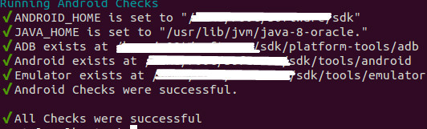
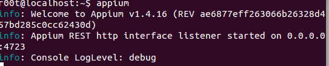
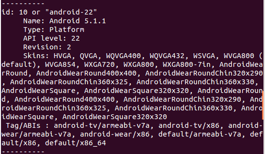
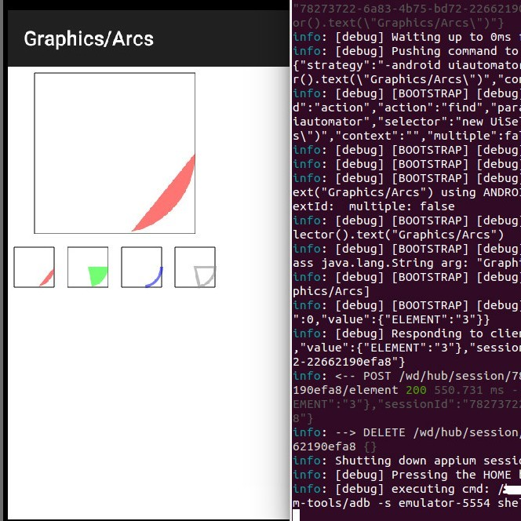

# Ubuntu 系統安裝 Appium 及樣例運行教程

## 第一，Appium介紹

Appium 是一個自動化測試開源工具，支持 iOS 平臺和 Android 平臺上的原生應用，web 應用和混合應用。所謂的“混合應用”是指原生代碼封裝網頁視圖——原生代碼和 web 內容交互。 重要的是，Appium 是一個跨平臺的工具：它允許測試人員在不同的平臺（iOS，Android）使用同一套API來寫自動化測試腳本，這樣大大增加了 iOS 和 Android 測試套件間代碼的複用性。

Appium無需重新編譯或修改你的應用，同時，它還不侷限於某種編程語言或者框架來編寫和運行你的測試腳本，不得不說出Appium是一款非常優秀的測試工具。

在安裝Appium過程中，新手可能會遇到一些麻煩和遭遇學習動力上打擊，儘管如此，我們社區對Appium測試框架的討論、學習熱情絲毫不減，一片如火如荼的場景。下面就Ubuntu\(14.04 LTS\)系統安裝Appium框架展開學習及給出在安裝過程中遇到的錯誤問題的解決方法。

## 第二，安裝環境依賴準備

* node
* npm
* Android SDK

注意，由於在安裝Appium文檔中，官方特別指出`最好不要使用sudo命令安裝node、npm軟件，否則後面安裝appium會遇到麻煩`，鑑於此，這裡我們使用已編譯好的nodejs版本省去了源碼本地編譯操作，根據自己機器型號下載對應版本，下載錯了，安裝時會出問題的。下載地址二進制nodejs版本下載

[https://nodejs.org/download/release/](https://nodejs.org/download/release/)

## 第三，安裝nodejs

### 1，將從上面鏈接中獲取的二進制nodejs版本壓縮包解壓到某一目錄下，之後把解壓包中bin目錄添加到PATH環境變量中。

測試nodejs是否配置成功，如下命令：

```bash
$ node -v
 v5.6.0
$ npm -v
 3.6.0
```

如果顯示以上輸出，則nodejs安裝成功。

### 2，安裝appium

執行命令：

```bash
npm install -g appium
```

## 第四，安裝Android SDK

### 1，將Android SDK壓縮包解壓到某一目錄下，配置ANDROID\_HOME和PATH環境變量。

如下， 在.bashrc文件中添加兩行代碼：

```bash
ANDROID_HOME=your_android_sdk_path/sdk
PATH=$PATH:$ANDROID_HOME/tools/:$ANDROID_HOME/platform-tools
```

注意，即便已在.bashrc文件中設置好了ANDROID\_HOME環境變量，在啟動appium-doc --android之前，也必須在shell會話裡重新執行設置ANDROID\_HOME變量：

```bash
export ANDROID_HOME=/usr/local/android-sdk-linux
```

### 2，添加 SDK 軟件包

終端執行命令：

```bash
$ android
```

需要等待幾分鐘安裝SDK軟件包，安裝完成後驗證ANDROID環境是否搭建成功。在終端執行：

```bash
$ export ANDROID_HOME="your_android_sdk_path/sdk"
$ appium-doctor --android --verbose
```

若有以下輸出，則Android配置成功：



## 第五，安裝Appium Python Client

```bash
$ pip install Appium-Python-Client
```

## 第六，啟動Appium

還是少不了shell中設定ANDROID\_HOME環境變量

```bash
$ export ANDROID_HOME="your_android_sdk_path/sdk"
$ appium
```

輸出如下，則啟動正常



## 第七，創建Android模擬器

### 1，列出所有可用的Android系統鏡像文件，執行：

```bash
$ android list targets
```

我機子上安裝了20多個android系統鏡像文件，這裡選擇Android 5.1.1版本。



### 2，創建android 模擬器，執行：

```bash
$ android create avd -n emulator-22 -t 10 --abi default/x86
```

上面命令參數n指定模擬器的名稱，參數t指定所使用系統鏡像id編號，即命令android list targets列出的可用鏡像文件id編號，具體值為上圖id的值。

### 3，啟動android模擬器

上面命令執行無誤後，開啟剛創建android模擬器，執行：

```bash
$ emulator -avd emulator-22
```

avd參數指定需要開啟的模擬器名稱，即為我們創建模擬器時使用參數n指定的名稱。



## 第八，使用Python運行appium測試樣例

Github上官方測試樣例代碼，下載

### 1，以android\_simple.py文件為例子，使用Appium

Python語言客戶端對android應用測試。打開android\_simple.py，修改setUp方法：

```python
def setUp(self):
        desired_caps = {}
        desired_caps['platformName'] = 'Android'
        desired_caps['platformVersion'] = '4.2'
        desired_caps['deviceName'] = 'Android Emulator'
        desired_caps['app'] = PATH(
            '../../../sample-code/apps/ApiDemos/bin/ApiDemos-debug.apk'
        )
```

其中desired\_caps\['platformVersion'\]值設定為我們創建模擬器時所使用的android對應版本。由於這裡我們前面創建的模擬器為android-22，故，4.2修改為5.1.1。同樣，desired\_caps\['deviceName'\]設備名稱修改為emulator-22，即為我們前面創建模擬器指定的名稱。最終setUp方法為：

```python
def setUp(self):
        desired_caps = {}
        desired_caps['platformName'] = 'Android'
        desired_caps['platformVersion'] = '5.1.1'
        desired_caps['deviceName'] = 'emulator-22'
        desired_caps['app'] = PATH(
            '../../../sample-code/apps/ApiDemos/bin/ApiDemos-debug.apk'
        )
```

### 2，開啟測試

```bash
$ py
.test android_simple.py
```

### 3，測試完成結束模擬器

```bash
$ adb emu kill
```

## 第九，遇到的問題及解決方法

1，在終端裡設置ANDROID\_HOME環境變量，

```bash
$ export ANDROID_HOME="your_android_sdk_path/sdk"
```

在前文中多次提到，很重要。如果缺少，則會在運行

```bash
$ appium-doctor --android --verbose
```

報錯：ANDROID\_HOME is not set 2，創建android模擬器中時會提示虛擬機加速問題，需要安裝KVM

2-1，安裝kvm

```bash
$ sudo apt-get install qemu-kvm libvirt-bin ubuntu-vm-builder bridge-utils
```

2-2， 添加用戶到kvm和libvirtd組

```bash
$ sudo adduser `id -un` kvm
$ sudo adduser `id -un` libvirtd
```

2-3，驗證用戶添加到組是否成功 執行：

```bash
$ groups
```

輸出

```bash
r00t adm cdrom sudo dip plugdev lpadmin sambashare kvm libvirtd
```

以上輸出表明用戶已添加到kvm and libvirtd組

2-4，驗證kvm安裝是否成功

```bash
$ virsh -c qemu:///system list
```

輸出：

```bash
     Id    名稱                         狀態
----------------------------------------------------
```

表示KVM安裝成功。

2-5，KVM安裝成功後機器可能還不能使用，最好可能需要進入bios中設置下。具體：進入Bios修改

Configure選項卡下的SVM為Enable，這樣機器就支持虛擬機加速了。

## 第十，總結

正如Appium所倡導的哲學一樣，它不侷限於某種語言或者框架來編寫和運行測試腳本，對同一個測試我們可以使用不同的編程語言，而且Appium支持的語言有很多，如Python、Java、Php、Ruby等。Appium自誕生已有3年曆史，社區討論氛圍很火，相信以後Appium受眾應該會越來越來多，Appium越來越強大。 第一次安裝Appium時是使用源碼的方式，多次嘗試沒有成功，可能是由於npm、node安裝存在問題，換成使用nodejs二進製版本順利安裝成功了。遇到異常使用google或者百度搜索都可以找到解決方法，除非碰到的問題太奇葩了。

剛接觸學習Appium測試框架，寫得不到的地方，歡迎各位大大批正。

## 附相關資源：

1，Android AVD命令 [http://developer.android.com/intl/zh-cn/tools/help/android.html](http://developer.android.com/intl/zh-cn/tools/help/android.html)

[http://developer.android.com/intl/zh-cn/tools/help/adb.html](http://developer.android.com/intl/zh-cn/tools/help/adb.html)

2，Android 模擬器命令

[http://developer.android.com/intl/zh-cn/tools/devices/emulator.html](http://developer.android.com/intl/zh-cn/tools/devices/emulator.html)

3，安裝KVM相關

[https://help.ubuntu.com/community/KVM/Installation](https://help.ubuntu.com/community/KVM/Installation)

